# 🌐 Portal Nova SAT Training

## 📘 Sobre o Projeto

Este aplicativo foi desenvolvido como um **ambiente de treinamento e simulação** para o **Portal da Nova SAT**. O principal propósito é servir como uma base sólida de aprendizado para desenvolvedores que estão ingressando na equipe ou desejam aprimorar suas habilidades em front-end.

O projeto replica um **ecossistema corporativo real**, oferecendo desafios comuns do dia a dia, como autenticação segura, consumo de APIs, gerenciamento de estado e interfaces responsivas e dinâmicas. Ele é mantido para garantir que as melhores práticas de desenvolvimento sejam seguidas e disseminadas.

### 🌟 Principais Funcionalidades

O portal é composto por diversas ferramentas e módulos funcionais:

*   **🔐 Autenticação e Segurança**:
    *   Sistema completo de **Login** e **Registro**.
    *   Proteção de rotas com **Guards**, impedindo acesso não autorizado às páginas internas.
    *   Gerenciamento de sessão seguro.

*   **📊 Dashboard Interativo**:
    *   Visualização centralizada de métricas e indicadores.
    *   Gráficos dinâmicos para análise de dados.
    *   Cards informativos com resumos rápidos.

*   **👥 Gestão de Usuários**:
    *   Listagem completa de usuários cadastrados.
    *   Funcionalidades de CRUD (Criar, Ler, Atualizar, Deletar).
    *   Interface intuitiva para administração de perfis.

*   **📝 Gerenciamento de Conteúdo (Cards)**:
    *   Criação e edição de cards informativos.
    *   Formulários dinâmicos para entrada de dados.
    *   Visualização detalhada de informações.

*   **🔗 Integrações Externas**:
    *   Exemplo prático de consumo de API externa (ex: listagem de usuários de serviço terceiro).
    *   Tratamento de estados de carregamento (loading) e erros.

*   **🎨 UI/UX Moderna**:
    *   **Dark Mode**: Suporte nativo a tema escuro e claro, persistente.
    *   **Responsividade**: Layout adaptável para Desktops, Tablets e Dispositivos Móveis.
    *   **Menu Lateral**: Navegação fluida e recolhível.

---

## 🛠️ Tecnologias Utilizadas

Este projeto foi construído utilizando uma stack moderna e robusta:

*   **Angular 19+**: Framework principal para construção da SPA (Single Page Application).
*   **TypeScript**: Linguagem base para maior segurança e tipagem estática.
*   **HTML5 & CSS3**: Estruturação semântica e estilização avançada (Flexbox, Grid).
*   **RxJS**: Programação reativa para manipulação de eventos e dados assíncronos.
*   **Angular Router**: Gerenciamento avançado de navegação e rotas.

---

## 🎯 Objetivos de Aprendizado

Ao explorar este repositório, espera-se que o desenvolvedor pratique:

1.  **Estruturação de Projetos**: Organização de pastas, módulos e componentes.
2.  **Componentização**: Criação de componentes reutilizáveis e isolados.
3.  **Fluxo de Dados**: Comunicação entre componentes (Input/Output) e Serviços.
4.  **Consumo de APIs**: Requisições HTTP (GET, POST, PUT, DELETE).
5.  **Design Responsivo**: Adaptação de interfaces para múltiplos dispositivos.

---

## 🚀 Como executar o projeto

### 1️⃣ Clonar o repositório

```bash
git clone http://gitlab.mprj.mp.br/gate/portal-nova-sat-training.git
cd portal-nova-sat-training
```     

### 2️⃣ Instalar dependências

```bash
npm install
```

### 3️⃣ Rodar localmente

```bash
npm start
```

Acesse em: `http://localhost:4200`

---

## 📂 Estrutura do Projeto

- `src/app/components`: Componentes reutilizáveis (Card, Header, Sidenav, etc.)
- `src/app/pages`: Páginas principais (Dashboard, About, Contact)
- `src/app/service`: Serviços para lógica de negócios e chamadas de API
- `src/assets/data`: Dados mockados (JSON)

---

## 📸 Galeria do Projeto

Confira abaixo como o sistema se comporta em diferentes cenários e dispositivos.

### 1. Acesso e Autenticação
Telas de entrada seguras e intuitivas.

<br>

#### Login
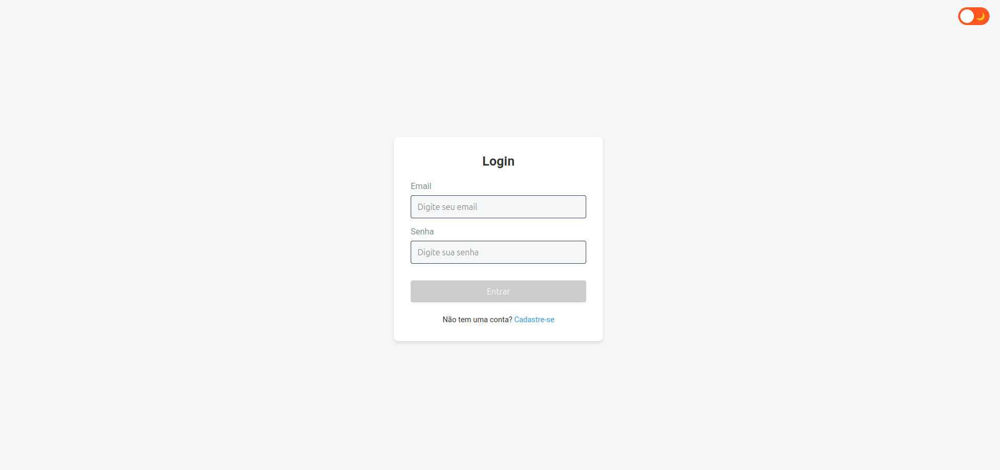
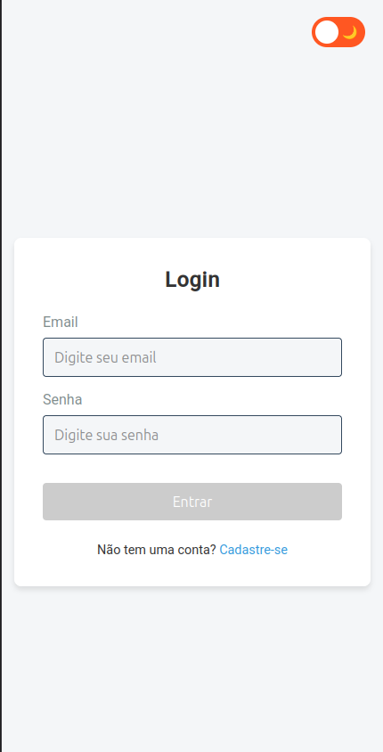

#### Registro
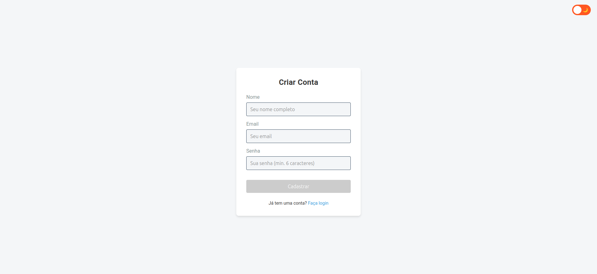

---

### 2. Dashboard Principal
A visão geral do sistema, com cards de métricas e gráficos interativos para análise rápida de dados.

<br>

#### Desktop
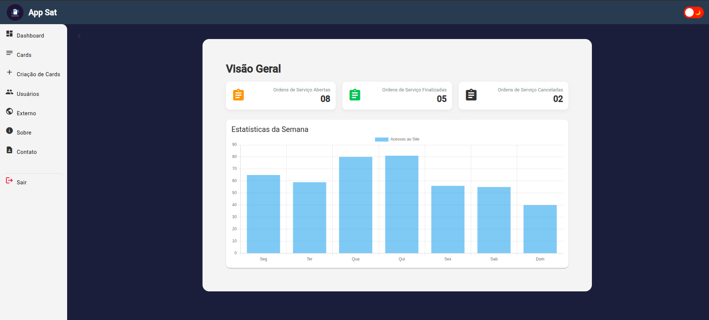

#### Mobile
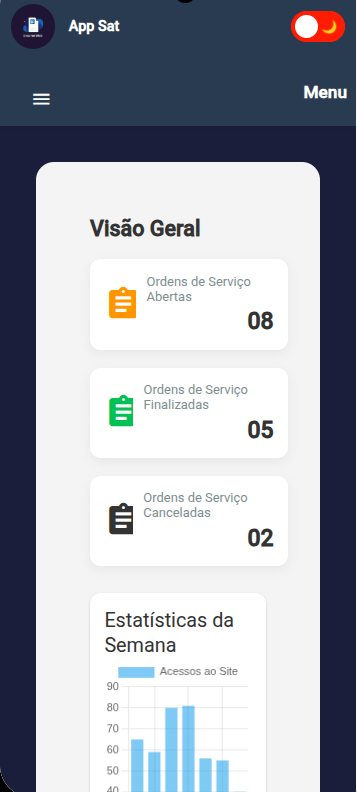

---

### 3. Gerenciamento de Cards
Área destinada ao controle de conteúdo informativo do portal.

<br>

#### Listagem de Cards
Visualização em grid dos cards disponíveis no sistema.

<br>

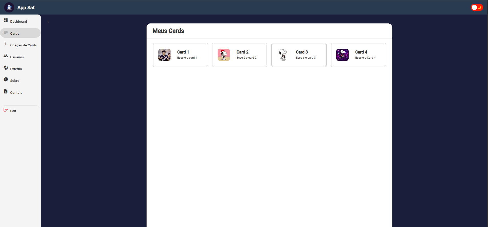

#### Criação de Novo Card
Formulário para adição de novos conteúdos.

<br>


---

### 4. Gestão de Usuários
<br>
Módulo administrativo para controle de usuários do sistema.
<br> 
CRUD(Create, Read, Update, Delete) de usuários.

<br>

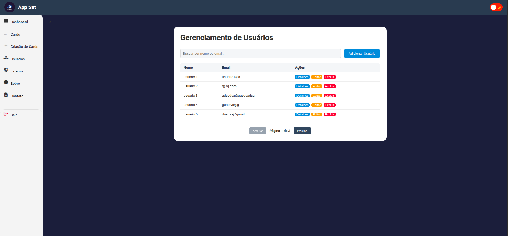

#### Paginação Personalizada
Sistema de navegação entre páginas de registros.

<br>

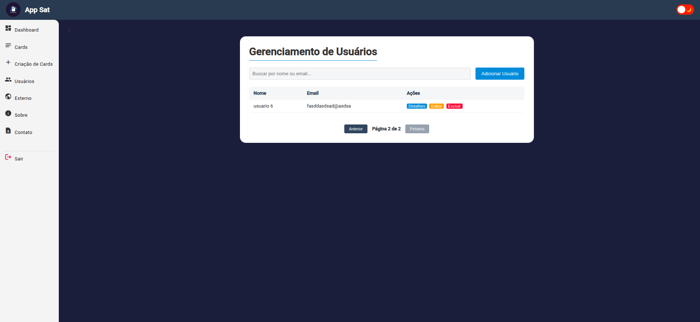

---

### 5. Integrações (API Externa)
Demonstração técnica de consumo de dados externos e tratamento de chamadas assíncronas.
<br>
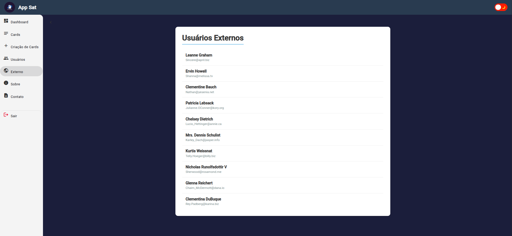

---

### 6. Institucional
Páginas de apoio e informações sobre o projeto.

<br>

#### Sobre
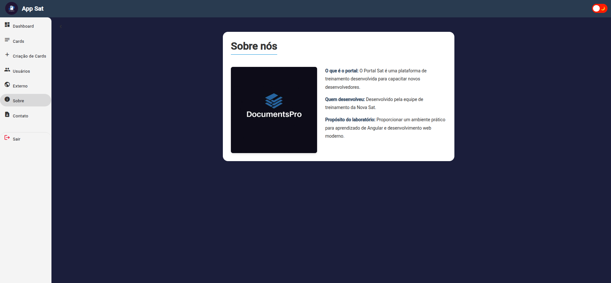

#### Contato
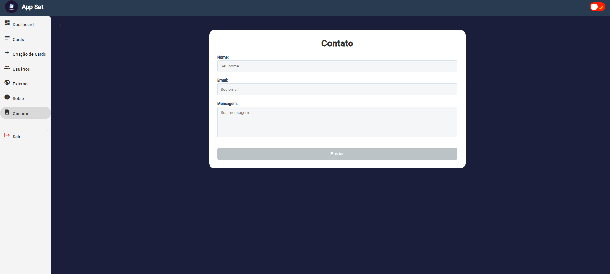

---

### 7. Navegação Mobile
Menu lateral adaptado para dispositivos móveis, garantindo acessibilidade em telas pequenas.

<br>


---

### 8. Modo Escuro
O portal oferece suporte nativo ao tema escuro, garantindo conforto visual e elegância.

<br>

#### Dashboard
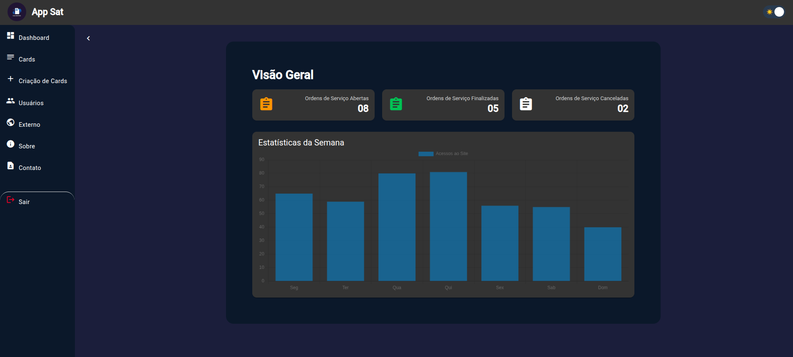

#### Cards
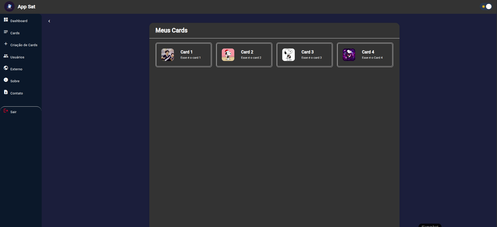

#### Contato
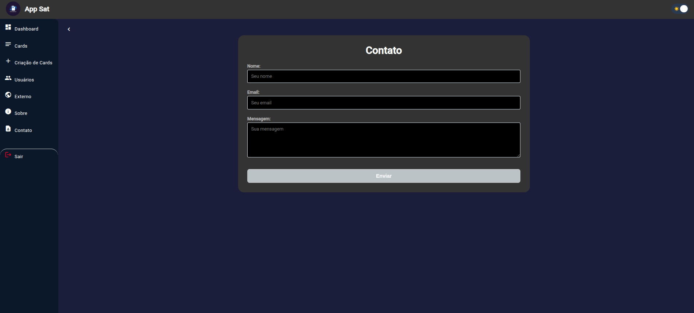


